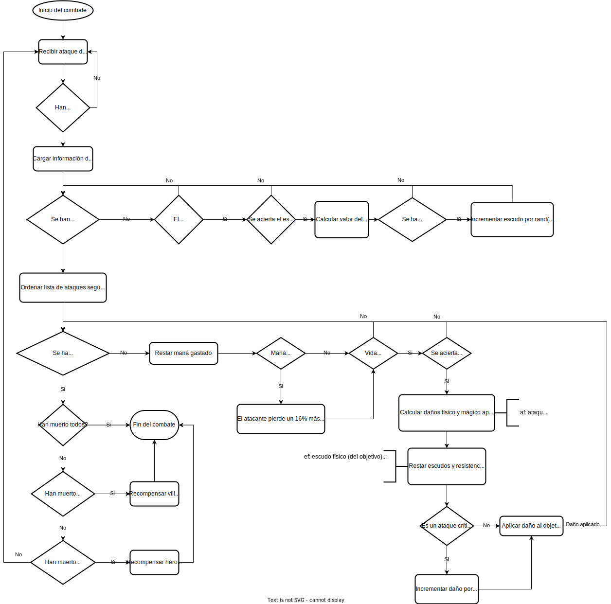

<h1 style="text-align:center;">Alfea Online</h1>

## Desarrollo

Se requiere el siguiente software:

- Python 3.12
- Node.js 20
- Redis

Se recomienda utilizar Docker con la siguiente configuración:

- Redis: ejecutar un contenedor con la [imagen oficial de Redis](https://hub.docker.com/_/redis).

```shell
$ docker run -d --name redis redis:latest
```

- Devcontainer: ejecutar el IDE en un contenedor de desarrollo permite trabajar con las versiones adecuadas sin necesidad de instalar nada más que Docker en tu equipo. Su configuración se encuentra en `.devcontainer/devcontainer.json` y se pueden usar con Visual Studio Code o editor de código que los soporte. En este caso, contiene Node.js y Python y se deben ejecutar los siguientes comandos, en dos terminales separadas, para iniciar el servidor de [Tailwind](https://tailwindcss.com/) (framework de CSS) y la aplicación Flask.

```shell
$ npm install # Instalar dependencias de Node.js
$ pip install -r requirements.txt # Instalar dependencias de Python
$ npm run dev # Generar CSS de Tailwind
$ python main.py # Servidor de desarrollo en 127.0.0.1:5000
```

## Producción

Se incluye un fichero  `docker-compose.yml` que inicia un contenedor con Redis y otro con la aplicación en modo producción con el servidor Gurnicorn, uno de los [recomendado en la documentación de Flask](https://flask.palletsprojects.com/en/3.0.x/deploying/). La web sería accesible desde el puerto 8000.

```shell
$ docker-compose up -d
```

Se requiere que el CSS de Tailwind haya sido generado en modo producción desde el entorno de desarrollo con el comando `npm run build`.

> En el zip se incluye el CSS generado, por tanto se puede iniciar directamente con Docker

# Diagrama de clases


# Combate

## Diagrama de secuencia


## Diagrama de flujo

