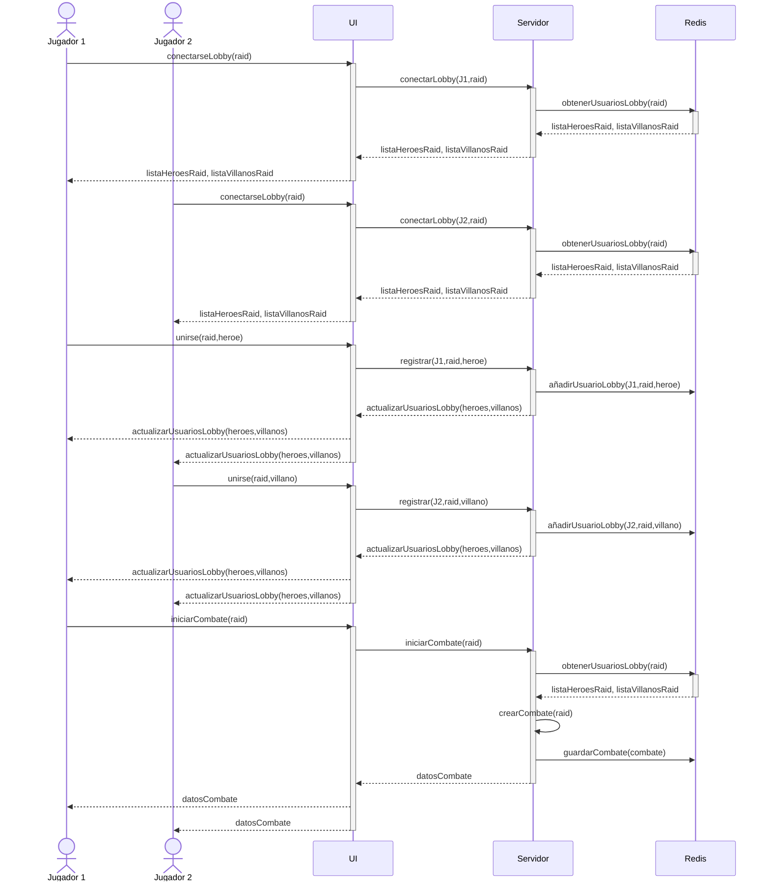

```mermaid
sequenceDiagram
	actor Jugador 1
	actor Jugador 2
	participant U as UI
	participant S as Servidor
	participant R as Redis
	
	Jugador 1->>U: conectarseLobby(raid)
	activate U
	U->>S: conectarLobby(J1,raid)
	activate S
	S->>R: obtenerUsuariosLobby(raid)
	activate R
	R-->>S: listaHeroesRaid, listaVillanosRaid
	deactivate R
	S-->>U: listaHeroesRaid, listaVillanosRaid
	deactivate S
	U-->>Jugador 1: listaHeroesRaid, listaVillanosRaid
	deactivate U
	Jugador 2->>U: conectarseLobby(raid)
	activate U
	U->>S: conectarLobby(J2,raid)
	activate S
	S->>R: obtenerUsuariosLobby(raid)
	activate R
	R-->>S: listaHeroesRaid, listaVillanosRaid
	deactivate R
	S-->>U: listaHeroesRaid, listaVillanosRaid
	deactivate S
	U-->>Jugador 2: listaHeroesRaid, listaVillanosRaid
	deactivate U
	
	Jugador 1->>U:unirse(raid,heroe)
	activate U
	U->>S:registrar(J1,raid,heroe)
	activate S
	S->>R:añadirUsuarioLobby(J1,raid,heroe)
	S-->>U:actualizarUsuariosLobby(heroes,villanos)
	deactivate S
	U-->>Jugador 1:actualizarUsuariosLobby(heroes,villanos)
	U-->>Jugador 2:actualizarUsuariosLobby(heroes,villanos)
	deactivate U
	
	Jugador 2->>U:unirse(raid,villano)
	activate U
	U->>S:registrar(J2,raid,villano)
	activate S
	S->>R:añadirUsuarioLobby(J2,raid,villano)
	S-->>U:actualizarUsuariosLobby(heroes,villanos)
	deactivate S
	U-->>Jugador 1:actualizarUsuariosLobby(heroes,villanos)
	U-->>Jugador 2:actualizarUsuariosLobby(heroes,villanos)
	deactivate U


	Jugador 1->>U:iniciarCombate(raid)
	activate U
	U->>S:iniciarCombate(raid)
	activate S
	S->>R:obtenerUsuariosLobby(raid)
	activate R
	R-->>S:listaHeroesRaid, listaVillanosRaid
	deactivate R
	S->>S:crearCombate(raid)
	S->>R:guardarCombate(combate)
	S-->>U:datosCombate
	deactivate S
	U-->>Jugador 1:datosCombate
	U-->>Jugador 2:datosCombate
	deactivate U

	
```

