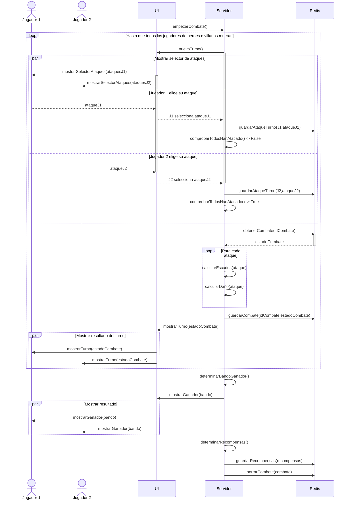

```mermaid
sequenceDiagram
	actor Jugador 1
	actor Jugador 2
	participant U as UI
	participant S as Servidor
	participant R as Redis
	
	U->>S: empezarCombate()
	
	loop Hasta que todos los jugadores de héroes o villanos mueran
        S->>U: nuevoTurno()
        activate S
        par Mostrar selector de ataques
            U->>Jugador 1: mostrarSelectorAtaques(ataquesJ1)
            activate U
            U->>Jugador 2: mostrarSelectorAtaques(ataquesJ2)
        and Jugador 1 elige su ataque
            Jugador 1-->>U: ataqueJ1
            U-->>S: J1 selecciona ataqueJ1
            S->>R: guardarAtaqueTurno(J1,ataqueJ1)
            S->>S: comprobarTodosHanAtacado() -> False
        and Jugador 2 elige su ataque
            Jugador 2-->>U: ataqueJ2
            deactivate U
            U-->>S: J2 selecciona ataqueJ2
            deactivate S
            S->>R: guardarAtaqueTurno(J2,ataqueJ2)
            S->>S: comprobarTodosHanAtacado() -> True
        end
      
        S->>R: obtenerCombate(idCombate)
        activate R
        R-->>S: estadoCombate
        deactivate R
        loop Para cada ataque
        	S->>S: calcularEscudos(ataque)
        	S->>S: calcularDaño(ataque)
        end
        S->>R: guardarCombate(idCombate,estadoCombate)
        S->>U: mostrarTurno(estadoCombate)

        par Mostrar resultado del turno
        U->>Jugador 1: mostrarTurno(estadoCombate)
        U->>Jugador 2: mostrarTurno(estadoCombate)
        end
       end
	S->>S: determinarBandoGanador()
	S->>U: mostrarGanador(bando)
	par Mostrar resultado
		U->>Jugador 1: mostrarGanador(bando)
		U->>Jugador 2: mostrarGanador(bando)
	end
	S->>S: determinarRecompensas()
	S->>R: guardarRecompensas(recompensas)
	S->>R: borrarCombate(combate)
	
```

